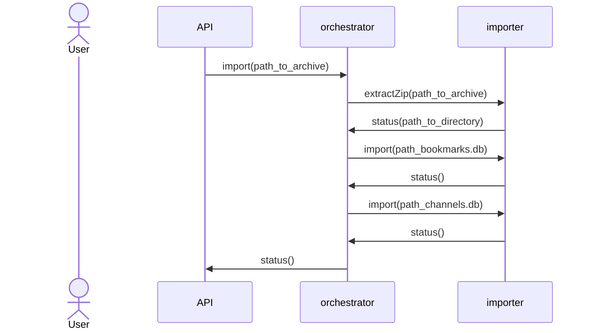

# Database import flow

## Overview

Process implemented as a state machine.

1. Extract db files from ZIP archive
2. Read all data from bookmarks.db
3. Read all data from channels.db
4. Transform data into common format and store in tubemanager.db

## Flow

